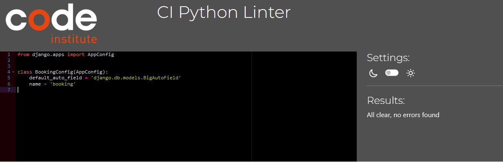

Return back to the [README.md](README.md) file.

### Manual testing

-   #### First Time Visitor Goals

    1. As a First Time Visitor, I want to easily understand the main purpose of the site and learn more about the business.
        1. Upon entering the site, users are automatically greeted with a clean and easily readable navigation bar to go to the page of their choice. Underneath there is a Hero Image with Text and a "Book a table" button. The name a resturant is a banner above the navigation bar.
        2. The main points are made immediately with the hero image, which is a restaurant interior and the text label attached to it.
        3. The user has two options, click the call to action button "Book a table" or go to the "Book a table" in the navigation bar, both will lead to the same place, to a log in page to make a reservation.

    2. As a First Time Visitor, I want to be able to easily navigate throughout the site to find content.
        1. The site has been designed to have minimum content per page so that the user is not entrapped. The content is limited to what it says in the navigation links. The navigation bar is more towards the middle of the page and each link clearly describes what the page where the user will end up does.

    3. As a First Time Visitor, I want to sign up for a user account to access restricted content.
        1. Once the new visitor has read the Home, Contact and Menu pages, had a look at what the Login and Register pages do, they might decide to book a table at the restaurant. They will click on the Book a Table navigation link, which will take them to the login page sign in form (hero image with restaurant interior and sign in form).
        2. The login page sign in form contains a link where user can create an account from: "If you have not created an account yet, then please sign up to make reservations." This way users can understand that all booking functionalities are only accessed for registered users.
        3. Once the user signs up by creating a username, optionally adding an email address, creating and repeating the password, they are redirected to the home page. 
        4. In the navbar now next to home, menu, contact and book a table links appears links My Bookings and Logout. Also appears a message (Successfully signed in as (username).)
    
    4. As a First Time Visitor, I want to create a table booking, view booking details, and make changes on created bookings.

        1. Once the first-time user has created an account and been redirected to the booking form, they can book a table.This time they will see a booking form with the  following form elements:
            - #### Form title "Table Booking Form"
            - #### The following input fields:
                *   ##### Customer name - takes alphanumerical characters
                *   ##### Phone number - takes alphanumerical characters
                *   ##### Reservation date and time - has a calendar popping up with date and time picker
                *   ##### Number of customers - takes only positive whole numbers (not 0)
            - #### Submit booking button

        2.  User enters in Customer name, phone number, reservation date and time and number of customers on the form.
        Although only two fields are marked with an asterisk, customer cannot submit without filling in all fields. 
        
        
        Once customer clicks on Submit booking, they are redirected to a page where bookings are arranged in a table. At the same time a pop up message appears just under the navbar: "Booking successful".
        The table where the booking(s) is visible has the following headings and the row(s) and columns(s) underneath:
        * Logged in User - username as per what user is logged in as
        * Customer name - as per user input on booking form
        * Reservation date and time - as per user input on booking form
        * Phone number - as per user input on booking form
        * Number of guests - as per user input on booking form
        * Edit booking - button
        * Delete booking - button

        3. If user decides that they do not wish to perform any further action on their booking, they can easily go on any other site page from the navbar that is visible straight above the bookings table.
        4. If user decides, that they wish to edit their booking, they must click on the Edit Booking button. The booking will appear on a separate page, on a form like the table booking form. The form has the following elements:
        - #### Form title "Edit Your Booking"
        - #### Link "Changed my mind, back to my booking" in case customer has changed their mind
        - #### The following input fields:
            *  ##### Customer name - as per user input when creating a booking
            *  ##### Phone number - as per user input when creating a booking
            *  ##### Reservation date and time - as per user input when creating a booking
            *  ##### Number of customers - as per user input when creating a booking
        - #### Submit edited booking button

        If user clicks on "Changed my mind, back to my booking" link, they are taken back to the previous page, to the table with all booking details.
        Whether user edits their booking details on the form or leave them unedited on the form and click on the "Submit edited booking" button, they are taken back to the previous page, to the table with all booking details. Additionally, user sees the following popup message "Your booking has been updated". If user enters a date in the past, the form won't update and the error message "Booking date must be in the future" appears. 
        Customer can then go onto any page after as per navbar links, which are displayed straight above the bookings table.
        
        5. If user decides, that they wish to delete their booking, they must click on the Delete Booking button. The booking will appear on a separate page, like a pop up message.The pop up has the following elements:
        - #### The pop up title: "Delete booking"
        - #### With following text: 
            * ##### Are you sure you want to delete booking with name (full_name) made on (date) ? This booking will be permanently deleted from the database.

        - #### Cancel deletion button
        - #### Delete booking button

        If user clicks on "Cancel" button, they are taken back to the previous page, to the table with all booking details.
        When user clicks on the "Delete" button, they are taken back to the previous page, to the table with all booking details, without the deleted booking details. Additionally, user sees the following popup message "Your booking has been deleted". If customer deletes all bookings a pop up will appear with text "You don't have a booking yet." and a "Book" button.

        
    5. As a First Time Visitor, I want to sign out of my user account at the end of the session to keep my account related details safe. 
        1. To accomplish this, user clicks on the Logout navbar link.
        2. A logout form with matching image as a background and with the following elements appears:
            *   Form title "Sign Out"
            *   Text "Are you sure you want to sign out?"
            *   Sign Out button
        3. If user clicks on the SIgn Out button, they are taken to the home page, at the same time the message "You have signed out" appears.

-   #### Returning and Frequent Visitor Goals

     1. As a Returning and Frequent Visitor, I want to sign into my user account to access restricted content.

        1. User clicks on Book a table button.
        2. They will be directed to the sign in form.
        3. They enter username and password created at the signup.
        4. If username and password match, they are taken to the home page. At the same time a pop up message appears
        "Successfully signed in as 'username'".
        5. If username and/or password are incorrect, the following message appears on the signup form: "The username and/or password you specified are not correct." User need to enter correct details or re-register. They are directed to the home page then.

    2. As a Returning and Frequent Visitor, I want to create a new table booking, view details of my newly made and previous bookings, and alternatively edit them or delete them.

        1. Users can create a new booking, as per the steps described above, by clicking on the booking form, from the Book a Table menu .
        2. After submitting the booking, users can view their newly added or older booking details. Editing and deleting can be done from there.
        3. Alternatively, if users do not wish to create a new booking, just would like to view their existing booking details or edit or delete them, they can click on the "My bookings" navbar link, which will be visible for authenticated users after login. This exposes the same page where users get after adding a booking.
        

    3. As a Returning and Frequent Visitor, I want to sign out of my account at the end of the session to keep my account safe.
        1. User should follow the steps described above for First Time Visitors.
    4. As a Returning and Frequent Visitor, I would like to see if there are any changes to the menu or opening hours.
        1. User goes on the Menu or Contact page to do this.

---

## Bugs 

- I encountered several challenges at the beginning of this project, as I was not very familiar with Django. However, as I progressed, I gained valuable knowledge and experience.

- One of the issues I faced was linking views with the page's URL. Through extensive research and the assistance of a friend, I successfully resolved this problem.

- When I first started working on this project, I faced some challenges related to Django URL patterns. Defining views in the URL paths was a bit tricky at first.

One issue I encountered was not understanding how to correctly connect the views to the URLs. It took me a while to grasp the concept of defining views, and I struggled with passing arguments such as booking_id in the URL patterns.

Additionally, I had some confusion regarding the naming of the URLs and how they should be referenced in the templates.

However, with the help of Django documentation and advice from a more experienced friend, I was able to overcome these challenges and successfully set up the URL patterns to navigate through different views in my Django web application.

- When working on this code, I noticed a bug related to the date field in the BookingForm. Initially, the form allowed users to select and book a table for a date in the past. This was incorrect since reservations should only be allowed for future dates.

To address this issue, I implemented a fix by adding a clean_date method in the form. This method checks if the selected date is in the past by comparing it with the current time using timezone.now().date(). If the selected date is in the past, a ValidationError is raised with a message indicating that the booking date must be in the future.

This fix ensures that users cannot make reservations for dates that have already passed, maintaining the integrity of the booking system and preventing the bug from occurring.

- Deployment Issues:

   - DEBUG Mode: Initially, my project's settings.py had the DEBUG mode set to True. This was a problem because in a production environment, it should be set to False for security and performance reasons.

   - Resolution: I updated the DEBUG setting to False for the production environment, ensuring that sensitive information and tracebacks were not exposed to users.

   - SECRET_KEY Security: My settings.py file contained the SECRET_KEY directly, which is a security risk if exposed.

   - Resolution: I moved the SECRET_KEY to an environment variable and used a secure method to access it.

   
   - Requirements for Deployment:

    - Missing Dependencies: During the deployment process, I encountered issues with missing Python package dependencies. My project relied on various packages like Django, but I hadn't documented these dependencies correctly.

## Validation:
### HTML Validation:

- **Home Page**

- **Menu Page**

- **Contact Page**

- **Booking Page**

- **View Booking Page**

- **Edit Booking Page**

- **Delete Booking Page**

- **Login Page**

- **Sign Out Page**

- No errors or warnings were found when passing through the official [W3C](https://validator.w3.org/) validator. This checking was done manually by copying the view page source code (Ctrl+U) and pasting it into the validator.

### CSS Validation:

- No errors or warnings were found when passing through the official [W3C (Jigsaw)](https://jigsaw.w3.org/css-validator/#validate_by_uri) validator except for the warnings about the use of css root variables and webkits for the box-shadow. However, css code works perfectly on various devices.

### Python Validation:

- **admin.py**

- **apps.py**

- **forms.py**

- **models.py**

- **ursl.py**

- **views.py**

- No errors were found when the code was passed through Heroku's [online validation tool](https://pep8ci.herokuapp.com/). According to the reports, the code is [Pep 8-compliant](https://legacy.python.org/dev/peps/pep-0008/). This checking was done manually by copying python code and pasting it into the validator.

---

## Compatibility

Testing was conducted on the following browsers;

- Chrome;

- Firefox;

-   The website was viewed on a variety of devices such as Desktop, Laptop, Samsung Galaxy A51 and Chrome Developer Tools. It is responsive on all devices and all features work as expected.
-   A large amount of testing was done to ensure that all pages were linking correctly. - See Testing User Stories
-   Friends and family members were asked to review the site and documentation to point out any bugs and/or user experience issues.

